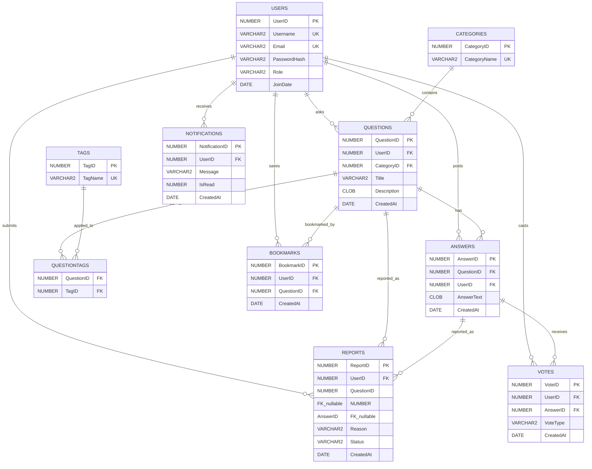

# Whisperia — ER Diagram & Database Design

## Entity Relationship Diagram

## Relationships

| Relationship | Type | Description |
|-------------|------|-------------|
| Users → Questions | 1:N | One user can ask many questions |
| Users → Answers | 1:N | One user can post many answers |
| Users → Votes | 1:N | One user can cast many votes |
| Users → Bookmarks | 1:N | One user can save many bookmarks |
| Users → Notifications | 1:N | One user receives many notifications |
| Users → Reports | 1:N | One user can submit many reports |
| Categories → Questions | 1:N | One category contains many questions |
| Questions → Answers | 1:N | One question has many answers |
| Questions ↔ Tags | M:N | Many-to-many via QuestionTags junction table |
| Answers → Votes | 1:N | One answer receives many votes |

## Normalization (3NF Proof)

### First Normal Form (1NF)
- All columns contain atomic values (no repeating groups)
- Each table has a primary key
- Tags are stored in a separate table rather than as a comma-separated list

### Second Normal Form (2NF)
- All non-key attributes are fully functionally dependent on the entire primary key
- QuestionTags composite key `(QuestionID, TagID)` — no partial dependencies

### Third Normal Form (3NF)
- No transitive dependencies exist
- CategoryName depends only on CategoryID (not stored in Questions)
- Username depends only on UserID (not duplicated in Questions/Answers)
- TagName depends only on TagID (not stored in QuestionTags)

## Candidate Keys

| Table | Candidate Keys |
|-------|---------------|
| Users | UserID (PK), Username, Email |
| Categories | CategoryID (PK), CategoryName |
| Tags | TagID (PK), TagName |
| Votes | VoteID (PK), (UserID, AnswerID) |
| Bookmarks | BookmarkID (PK), (UserID, QuestionID) |
